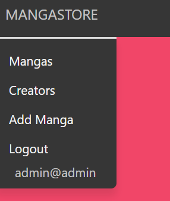

# MangaStore - T2A2 Rails Marketplace App

## By Muhammed Tayyeb Khan

### Heroku Live App Site

https://mighty-fjord-91560.herokuapp.com/

### Github repo

https://github.com/MTayyebKhan/railsapp

### Instructions on how to setup, configure and use the App. (Windows)

1. Clone the git repository

        git clone https://github.com/MTayyebKhan/railsapp

2. Navigate into directory

        cd manga_application

3. Install required gems

        bundle install

4. Create database, run migrations and seed database with sample data.

        rails db:setup

5. Optional: If you do not want seed data

        rails db:create
        rails db:migrate

6. Start the rails server

        rails s

7. Open a web browser and go to http://localhost:3000

 

# Description: What is it and what problem does it solve:

 

The MangaStore is an app built to bring together a community of comic enthusiasts to share there work and provide a means of income to artists who enjoy the genre as well as a place for buyers to find complete works of mangas and comics without the hassle of signing up.

Most comic sites require a signed in user to buy products leading to data being sold without there knowledge aswell as sellers need to be recognized before attempting to sell there product, the mangastore aims to help stop this issue.

## Purpose

As a concept the Mangastore is to demonstrate a simple design and straighforward approach to a community driven marketplace. By simplyfying the user experience for both sellers and buyers it emphasizes the instant aquisition of purchased comics as well as the selling of them too.

## Functionality / features

The main functionality and feature of this application is the minimalistic interface, multi-platform useage to support a diverse market ecosystem. It is built with user privacy in mind, having a one end encryption to help the failing of data privacy in this day and age where other big known companies are seen in court for selling their client information for corporate greed. All this is managed by the admin approving what can and can't be sold in case of copyright infringement and or illegal products.

## Sitemap

 
 

## Screenshots

### Landing Page

 

 
 

### Viewing Page

 

 
 

### Writers Page

 

 
 

### Login Page

 

 
 

### Signup Page

 

 
 

### Buy Page

 

 
 

### Edit/Create Page

 

 
 

### Stripe Page

 

 
 

### Desktop Nav

 

 
 

### Mobile View

 

 
 

## Target audience

Mangastore is designed to target individuals who are into the comic and manga genre without the worry of ethical breaches towards there information as stated earlier. On the other hand, there are many young, talented and worthwhile artists who are struggling within this industry to due the giants in the market overshadowing there work as well as pushing it aside, leading them to difficulty in spreading there work for a decent amount of pay. This app is to give all users a genuine and straightforward value to there time and money.

## Tech stack

- HTML
- CSS
- SASS
- Balsamiq
- Javascript / JQuery
- Ruby on Rails
- Stripe
- Heroku
- Rspec
- Devise
- Rolify
- Cloudinary

# User stories

- As a user I want to be able to buy items.
- As a user I want to be able to sign up.
- As a user I want to be able to login with my existing account.
- As a user I want to be able to retrieve my password if i've forgotten it.
- As a user I want to be to change my password.
- As a user I want to be able to find mangas in relation to their creator.
- As a user I should be able to select an item, and view it in a dedicated view page.
- As a user I should find the 'Buy now' option in a dedicated page.

 

- As an admin I want to be able to list my manga with photos, title the name of the creator.
- As an admin I want to be able to make and receive payments.
- As an admin I should be able to view, edit, and delete all items.  
- As an admin I should be able to perform all normal user roles.

# Wireframes

### Landing Page

 

 
 

### Viewing Page

 

 
 

### Writers Page

 

 
 

### Login Page

 

 
 

### Signup Page

 

 
 

### Create Page

 

 
 

### Edit Page

 

 
 

### Forgot Password Page

 

 
 

# ERD

# High-level components

- Logging in / Signing Up

To handle sensitive information such as email and password, the third party app devise is implemented into the app. Devise is responsible for handling the users athentication, encyryption of passwords and to check if the user exists and is using the correct password.

- Purchasing of an item

To allow a safe and secure method for transactions, Stripe has been used. Stripe allows the user to enter a redirected portal for payment. This assists in the processing of sensitive information in regards to purchase and payments.

- Hosting images

Users wanting to sell that wish to upload and attach an accompanying image for greater impact, Cloudinary was implemented. Allowing for faster loading of pages, enhancing the viewer experience aswell.

- Authorizing user/admin privileges

Limitations have been placed to normal users. Rolify, a gem for Rails, allows a user to have admin priviledges via changing there role within the database given them access to specific pages such as editing and deleting products.

# Third party services

- Heroku: a website application hosting service.
- Cloudinary: a image/s file hosting service.
- Devise: a user registration and authentication gem.
- Rolify: a user role assignment and authorization gem.
- Bulma: a styling gem.
- Stripe: a cloud payment service.

# Model relationships

Genre - Stores the genres

- Has many mangasgenres
- Has many mangas through mangas genres

Manga - Stores details of the Manga

- Belongs to writer
- Has many mangas genres
- Has many genres
- Has one attached cover

MangasGenre - Stores the Genre to the manga

- Belongs to manga
- Belongs to genre

Role - Stores user information

- Has and belongs to many users
  
Writer - Stores the writers information

- Has many mangas

# Database relations

- One to One

This is used when one record within table one relates to only one record in another table. To set this up in rails one model needs to be given a belongs_to relationship and the related model needs to be set to has_one. Example: One manga has one cover.

- One to Many

This relationship is used when a single record in one table has many related records in another table. This is achieved by using belongs_to and has_many in the rails models. Example: One manga can have many genres.

- Many to Many

This relationship allows for records in table 1 to have many related records in table 2 and vice versa. Example: Mangas can have many genres and genres can have many mangas.

# Provide your database schema design

# Describe the way tasks are allocated and tracked in your project

In order to keep track of required tasks, I used sticky notes to map out the features I required. Due to a lot of the changes that the design had to undergo as well as development issues it was far simpler to edit and add more to my notes as features changed and designs got updated with a backlog of everything I have done dated with time stamps. Furthermore, having the notes always in front of me helped subconsiously moved ahead in my developing process.

# Future Improvements

Due to time restraints this features would have been included in the final product before submission but due to my lack of understanding and implenting code within the time that is given I can only suggest what I envisioned for the mangastore for future improvements.

### User experience
The user experience at this point is minimal, reflecting only the most simple actions a user would undertake. However, many fairly vital and commonly used tools are missing such as the ability to search for mangas. As well as the function to apply a rating and comment on an item that has been bought.

### Administration experience
While administration privileges do exist, having a dashboard for an admin that can manage all sale requests from creators witha filtering capability and the ability to instantly approve a product to be put up for sale, as well as declining a product with email intergration to the user. This would help ease managing products for the admins.

### Profiles
The manga community love to have avatars and an online presence, so the capability to create an online profile to be who they wish to be would be ideal in this space. This would further add to comments made on purchased products and can also lead into instant messaging within the app, that should also allow direct access to conversations between users from their profile pages, this also leads to the next point.

### Messaging
The main feature in the application is of purchasing and selling, but a hidden feature should be the ability to make connections with other like minded individuals through a messaging system. As it does not exist at this point, having 'IM' is a vital aspect to an app about manga.

### Terms and conditions
Finally, the reason why the mangastore is to stand out amongst the rest is due to our data protection policy, so a added terms and conditions when signing up needs to be implented stating our promise of protection as well as what we expect from our users.